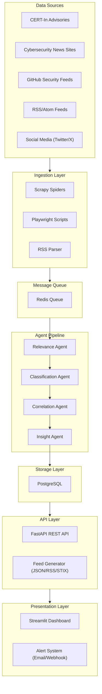
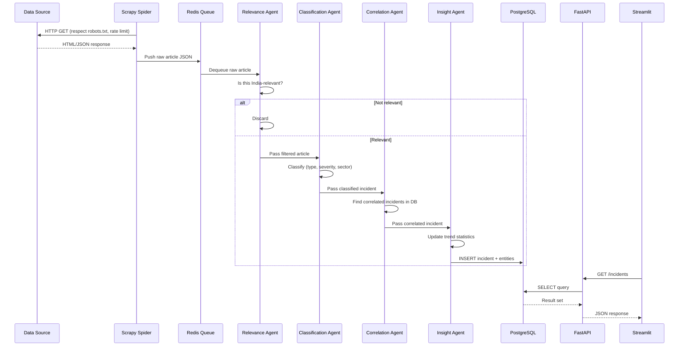
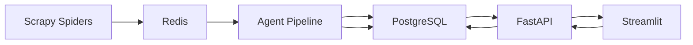

# ARCHITECTURE.md — System Architecture
<!-- STATUS: ACTIVE | LAST_UPDATED: 2026-09-24 | VERSION: 1.0 -->

> **Purpose**: Complete system architecture reference. Read `PROJECT_RULES.md` first.

---

## 1. High-Level Architecture



---

## 2. Component Descriptions

### 2.1 Data Sources (External)
| Source | Type | URL Pattern | Update Frequency |
|---|---|---|---|
| CERT-In | Government advisories | `https://www.cert-in.org.in/` | Daily |
| The Hacker News | News articles | `https://thehackernews.com/` | Multiple/day |
| BleepingComputer | News articles | `https://www.bleepingcomputer.com/` | Multiple/day |
| SecurityWeek | News articles | `https://www.securityweek.com/` | Daily |
| GitHub Advisory DB | CVE data | `https://github.com/advisories` | Continuous |
| CISA KEV | Known exploits | `https://www.cisa.gov/known-exploited-vulnerabilities-catalog` | Weekly |

> [!NOTE]
> Start with CERT-In + 2 news sites for MVP. Expand sources incrementally.

### 2.2 Ingestion Layer
| Component | Technology | Responsibility |
|---|---|---|
| `scraper/spiders/` | Scrapy | Crawl static HTML pages, extract structured data |
| Playwright scripts | Playwright | Handle JavaScript-rendered pages (e.g., dynamic tables) |
| RSS Parser | `feedparser` | Parse RSS/Atom feeds from news portals |

**Data flow**: Source → Spider/Parser → Scrapy Pipeline → Redis Queue

### 2.3 Redis Message Queue
- **Purpose**: Decouple ingestion from processing; buffer raw articles
- **Queue name**: `incident:raw`
- **Message format**: JSON with fields `source_url`, `title`, `content`, `scraped_at`
- **TTL**: 24 hours for unprocessed messages

### 2.4 Agent Pipeline
Agents process data **sequentially** through a pipeline:

```
Raw Article → [Relevance Agent] → [Classification Agent] → [Correlation Agent] → [Insight Agent] → Database
```

Each agent is a Python class inheriting from `BaseAgent`. See `AGENT_DESIGN.md` for full specifications.

### 2.5 PostgreSQL Database
- **Purpose**: Persistent structured storage for all processed incidents
- **Schema**: See `DATA_MODELS.md` for complete table definitions
- **Key tables**: `incidents`, `sources`, `entities`, `incident_entities`, `sectors`

### 2.6 FastAPI REST API
- **Base URL**: `http://localhost:8000/api/v1`
- **Key endpoints**:
  - `GET /incidents` — Paginated incident list with filters
  - `GET /incidents/{id}` — Single incident detail
  - `GET /feed/json` — JSON feed of latest incidents
  - `GET /feed/rss` — RSS-format feed
  - `GET /stats/overview` — Aggregate statistics
  - `GET /stats/trends` — Time-series trend data
  - `GET /health` — Health check

### 2.7 Streamlit Dashboard
- **Multi-page app** with sidebar navigation
- **Pages**:
  - **Live Feed**: Real-time incident table with filters
  - **Analytics**: Attack type distribution, severity breakdown, timeline charts
  - **Heatmap**: Sector-wise vulnerability heat visualization

### 2.8 Alert System
- **Trigger**: High-severity incidents (severity ≥ `critical`)
- **Channels**: Email (SMTP) and/or webhook (Slack/Discord)
- **Implementation**: Background task in FastAPI or separate alert service

---

## 3. Data Flow — End to End



---

## 4. Deployment Architecture

### 4.1 Development (Local)
```
┌─────────────────────────────────────────┐
│ Windows Machine                         │
│                                         │
│  .venv (Python 3.11)                    │
│  ├── uvicorn (port 8000)   ← Backend   │
│  ├── streamlit (port 8501) ← Dashboard │
│  │                                      │
│  PostgreSQL (port 5432)    ← Database   │
│  Redis (port 6379)         ← Queue      │
└─────────────────────────────────────────┘
```

### 4.2 Production (Docker Compose)
```yaml
services:
  backend:    # FastAPI app
  dashboard:  # Streamlit app
  postgres:   # PostgreSQL 15
  redis:      # Redis 7
  scraper:    # Scrapy + scheduler (cron-like)
```

### 4.3 Production (Cloud — Future)
- Oracle Cloud Free Tier or equivalent
- Same Docker Compose stack
- Nginx reverse proxy for HTTPS

---

## 5. Security Architecture

| Concern | Approach |
|---|---|
| **API Authentication** | API key header for external consumers (MVP: no auth for local dev) |
| **Database** | Connection via env vars, no hardcoded credentials |
| **Scraping Ethics** | robots.txt compliance, 2s rate limit, User-Agent identification |
| **PII** | Filter out personal data before DB insertion |
| **Secrets** | `.env` file, never committed to git |
| **CORS** | Configured in FastAPI for dashboard origin only |

---

## 6. Component Dependencies



**Build order** (must be built in this sequence):
1. Database (PostgreSQL + models + migrations)
2. Config + Settings
3. FastAPI skeleton + health endpoint
4. Pydantic schemas
5. API routes (CRUD)
6. Scrapy spiders (1 source first)
7. Redis queue integration
8. Agent pipeline (Relevance → Classification → Correlation → Insight)
9. Feed generator
10. Streamlit dashboard
11. Alert system
12. Docker Compose
13. Tests

> [!IMPORTANT]
> Follow this build order strictly. Each step depends on the previous ones.
