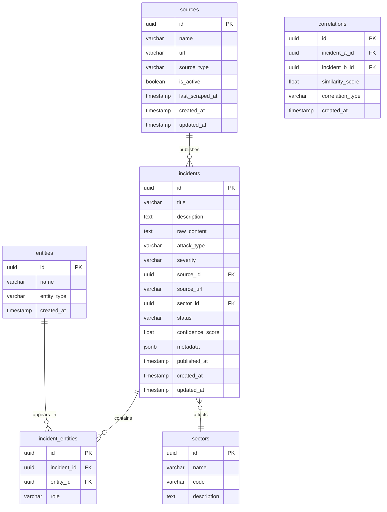

# DATA_MODELS.md — Database Schemas, Pydantic Models & API Contracts
<!-- STATUS: ACTIVE | LAST_UPDATED: 2026-09-24 | VERSION: 1.0 -->

> **Purpose**: Complete reference for all data structures in the system. Read `PROJECT_RULES.md` first.

---

## 1. Incident Taxonomy (Classification Constants)

### 1.1 Attack Types
```python
ATTACK_TYPES = [
    "ddos",
    "ransomware",
    "phishing",
    "data_breach",
    "apt_campaign",       # Advanced Persistent Threat
    "defacement",
    "malware",
    "sql_injection",
    "xss",                # Cross-site scripting
    "supply_chain",
    "insider_threat",
    "zero_day",
    "credential_stuffing",
    "dns_hijacking",
    "unknown",
]
```

### 1.2 Severity Levels
```python
SEVERITY_LEVELS = [
    "info",        # Informational, no immediate threat
    "low",         # Minor impact, low urgency
    "medium",      # Moderate impact, some urgency
    "high",        # Significant impact, urgent
    "critical",    # Severe impact, immediate action required
]
```

### 1.3 Sectors (Indian Critical Infrastructure)
```python
SECTORS = [
    "government",
    "banking_finance",
    "healthcare",
    "energy_power",
    "telecom",
    "defence",
    "transportation",
    "education",
    "it_ites",
    "manufacturing",
    "media",
    "retail_ecommerce",
    "other",
]
```

### 1.4 Source Types
```python
SOURCE_TYPES = [
    "government_advisory",   # CERT-In, NCIIPC
    "news_article",          # The Hacker News, BleepingComputer
    "social_media",          # Twitter/X
    "github_advisory",       # GitHub Security Advisories
    "rss_feed",              # RSS/Atom feeds
    "blog_post",             # Security researcher blogs
    "paste_site",            # Pastebin-like sites (public only)
]
```

---

## 2. PostgreSQL Database Schema

### 2.1 ER Diagram



### 2.2 Table: `sources`
Tracks all data sources the system scrapes.

| Column | Type | Constraints | Description |
|---|---|---|---|
| `id` | UUID | PK, default gen | Unique source identifier |
| `name` | VARCHAR(255) | NOT NULL, UNIQUE | Human-readable name (e.g., "CERT-In") |
| `url` | VARCHAR(2048) | NOT NULL | Base URL of the source |
| `source_type` | VARCHAR(50) | NOT NULL | One of `SOURCE_TYPES` |
| `is_active` | BOOLEAN | DEFAULT true | Whether scraper should crawl this |
| `scrape_config` | JSONB | NULLABLE | Spider-specific configuration |
| `last_scraped_at` | TIMESTAMPTZ | NULLABLE | Last successful scrape time |
| `created_at` | TIMESTAMPTZ | NOT NULL, DEFAULT now | Record creation time |
| `updated_at` | TIMESTAMPTZ | NOT NULL, DEFAULT now | Last modification time |

### 2.3 Table: `incidents`
Core table — every cyber incident is one row.

| Column | Type | Constraints | Description |
|---|---|---|---|
| `id` | UUID | PK, default gen | Unique incident identifier |
| `title` | VARCHAR(500) | NOT NULL | Incident headline |
| `description` | TEXT | NULLABLE | Processed summary |
| `raw_content` | TEXT | NULLABLE | Original scraped text |
| `attack_type` | VARCHAR(50) | NOT NULL, DEFAULT "unknown" | One of `ATTACK_TYPES` |
| `severity` | VARCHAR(20) | NOT NULL, DEFAULT "info" | One of `SEVERITY_LEVELS` |
| `source_id` | UUID | FK → sources.id | Which source reported this |
| `source_url` | VARCHAR(2048) | NOT NULL | Direct URL to the article/report |
| `sector_id` | UUID | FK → sectors.id, NULLABLE | Affected sector |
| `status` | VARCHAR(20) | DEFAULT "new" | `new`, `reviewed`, `confirmed`, `dismissed` |
| `confidence_score` | FLOAT | DEFAULT 0.0 | ML classification confidence (0.0–1.0) |
| `india_relevance_score` | FLOAT | DEFAULT 0.0 | India relevance score (0.0–1.0) |
| `metadata` | JSONB | DEFAULT {} | Flexible extra data (CVEs, IPs, etc.) |
| `published_at` | TIMESTAMPTZ | NULLABLE | When the source published the article |
| `created_at` | TIMESTAMPTZ | NOT NULL, DEFAULT now | Record creation time |
| `updated_at` | TIMESTAMPTZ | NOT NULL, DEFAULT now | Last modification time |

**Indexes**:
- `idx_incidents_attack_type` on `attack_type`
- `idx_incidents_severity` on `severity`
- `idx_incidents_created_at` on `created_at DESC`
- `idx_incidents_source_id` on `source_id`
- `idx_incidents_source_url` UNIQUE on `source_url` (deduplication)

### 2.4 Table: `entities`
Named entities extracted via NER (organizations, IPs, CVEs, threat actors).

| Column | Type | Constraints | Description |
|---|---|---|---|
| `id` | UUID | PK, default gen | Unique entity identifier |
| `name` | VARCHAR(500) | NOT NULL | Entity text (e.g., "AIIMS Delhi") |
| `entity_type` | VARCHAR(50) | NOT NULL | `organization`, `ip_address`, `cve_id`, `threat_actor`, `country`, `software` |
| `created_at` | TIMESTAMPTZ | NOT NULL, DEFAULT now | Record creation time |

**Indexes**:
- UNIQUE on `(name, entity_type)` — no duplicate entities

### 2.5 Table: `incident_entities` (Junction)
Links incidents to their extracted entities.

| Column | Type | Constraints | Description |
|---|---|---|---|
| `id` | UUID | PK, default gen | Row identifier |
| `incident_id` | UUID | FK → incidents.id, NOT NULL | The incident |
| `entity_id` | UUID | FK → entities.id, NOT NULL | The entity |
| `role` | VARCHAR(50) | DEFAULT "mentioned" | `target`, `attacker`, `tool`, `mentioned` |

### 2.6 Table: `sectors`
Pre-populated reference table.

| Column | Type | Constraints | Description |
|---|---|---|---|
| `id` | UUID | PK, default gen | Unique sector identifier |
| `name` | VARCHAR(100) | NOT NULL, UNIQUE | Display name (e.g., "Banking & Finance") |
| `code` | VARCHAR(50) | NOT NULL, UNIQUE | One of `SECTORS` enum values |
| `description` | TEXT | NULLABLE | Sector description |

### 2.7 Table: `correlations`
Links related incidents discovered by the Correlation Agent.

| Column | Type | Constraints | Description |
|---|---|---|---|
| `id` | UUID | PK, default gen | Row identifier |
| `incident_a_id` | UUID | FK → incidents.id | First incident |
| `incident_b_id` | UUID | FK → incidents.id | Second incident |
| `similarity_score` | FLOAT | NOT NULL | Similarity (0.0–1.0) |
| `correlation_type` | VARCHAR(50) | NOT NULL | `same_event`, `related_campaign`, `same_actor`, `same_cve` |
| `created_at` | TIMESTAMPTZ | NOT NULL, DEFAULT now | When correlation was found |

---

## 3. SQLAlchemy ORM Models

### 3.1 File: `backend/app/models/incident.py`
```python
import uuid
from datetime import datetime
from sqlalchemy import Column, String, Text, Float, Boolean, ForeignKey, Index
from sqlalchemy.dialects.postgresql import UUID, JSONB, TIMESTAMP
from sqlalchemy.orm import relationship
from app.database import Base


class Incident(Base):
    __tablename__ = "incidents"

    id = Column(UUID(as_uuid=True), primary_key=True, default=uuid.uuid4)
    title = Column(String(500), nullable=False)
    description = Column(Text, nullable=True)
    raw_content = Column(Text, nullable=True)
    attack_type = Column(String(50), nullable=False, default="unknown")
    severity = Column(String(20), nullable=False, default="info")
    source_id = Column(UUID(as_uuid=True), ForeignKey("sources.id"), nullable=True)
    source_url = Column(String(2048), nullable=False, unique=True)
    sector_id = Column(UUID(as_uuid=True), ForeignKey("sectors.id"), nullable=True)
    status = Column(String(20), default="new")
    confidence_score = Column(Float, default=0.0)
    india_relevance_score = Column(Float, default=0.0)
    metadata_ = Column("metadata", JSONB, default={})
    published_at = Column(TIMESTAMP(timezone=True), nullable=True)
    created_at = Column(TIMESTAMP(timezone=True), default=datetime.utcnow, nullable=False)
    updated_at = Column(TIMESTAMP(timezone=True), default=datetime.utcnow, onupdate=datetime.utcnow, nullable=False)

    # Relationships
    source = relationship("Source", back_populates="incidents")
    sector = relationship("Sector", back_populates="incidents")
    incident_entities = relationship("IncidentEntity", back_populates="incident")

    __table_args__ = (
        Index("idx_incidents_attack_type", "attack_type"),
        Index("idx_incidents_severity", "severity"),
        Index("idx_incidents_created_at", "created_at"),
    )
```

### 3.2 File: `backend/app/models/source.py`
```python
import uuid
from datetime import datetime
from sqlalchemy import Column, String, Boolean
from sqlalchemy.dialects.postgresql import UUID, JSONB, TIMESTAMP
from sqlalchemy.orm import relationship
from app.database import Base


class Source(Base):
    __tablename__ = "sources"

    id = Column(UUID(as_uuid=True), primary_key=True, default=uuid.uuid4)
    name = Column(String(255), nullable=False, unique=True)
    url = Column(String(2048), nullable=False)
    source_type = Column(String(50), nullable=False)
    is_active = Column(Boolean, default=True)
    scrape_config = Column(JSONB, nullable=True)
    last_scraped_at = Column(TIMESTAMP(timezone=True), nullable=True)
    created_at = Column(TIMESTAMP(timezone=True), default=datetime.utcnow, nullable=False)
    updated_at = Column(TIMESTAMP(timezone=True), default=datetime.utcnow, onupdate=datetime.utcnow, nullable=False)

    # Relationships
    incidents = relationship("Incident", back_populates="source")
```

### 3.3 File: `backend/app/models/entity.py`
```python
import uuid
from datetime import datetime
from sqlalchemy import Column, String, ForeignKey, Float, UniqueConstraint
from sqlalchemy.dialects.postgresql import UUID, TIMESTAMP
from sqlalchemy.orm import relationship
from app.database import Base


class Entity(Base):
    __tablename__ = "entities"

    id = Column(UUID(as_uuid=True), primary_key=True, default=uuid.uuid4)
    name = Column(String(500), nullable=False)
    entity_type = Column(String(50), nullable=False)
    created_at = Column(TIMESTAMP(timezone=True), default=datetime.utcnow, nullable=False)

    incident_entities = relationship("IncidentEntity", back_populates="entity")

    __table_args__ = (
        UniqueConstraint("name", "entity_type", name="uq_entity_name_type"),
    )


class IncidentEntity(Base):
    __tablename__ = "incident_entities"

    id = Column(UUID(as_uuid=True), primary_key=True, default=uuid.uuid4)
    incident_id = Column(UUID(as_uuid=True), ForeignKey("incidents.id"), nullable=False)
    entity_id = Column(UUID(as_uuid=True), ForeignKey("entities.id"), nullable=False)
    role = Column(String(50), default="mentioned")

    incident = relationship("Incident", back_populates="incident_entities")
    entity = relationship("Entity", back_populates="incident_entities")


class Sector(Base):
    __tablename__ = "sectors"

    id = Column(UUID(as_uuid=True), primary_key=True, default=uuid.uuid4)
    name = Column(String(100), nullable=False, unique=True)
    code = Column(String(50), nullable=False, unique=True)
    description = Column(String(500), nullable=True)

    incidents = relationship("Incident", back_populates="sector")


class Correlation(Base):
    __tablename__ = "correlations"

    id = Column(UUID(as_uuid=True), primary_key=True, default=uuid.uuid4)
    incident_a_id = Column(UUID(as_uuid=True), ForeignKey("incidents.id"), nullable=False)
    incident_b_id = Column(UUID(as_uuid=True), ForeignKey("incidents.id"), nullable=False)
    similarity_score = Column(Float, nullable=False)
    correlation_type = Column(String(50), nullable=False)
    created_at = Column(TIMESTAMP(timezone=True), default=datetime.utcnow, nullable=False)
```

---

## 4. Pydantic Schemas (Request/Response)

### 4.1 File: `backend/app/schemas/incident.py`
```python
from uuid import UUID
from datetime import datetime
from typing import Optional
from pydantic import BaseModel, Field


# --- Base ---
class IncidentBase(BaseModel):
    title: str = Field(..., max_length=500)
    description: Optional[str] = None
    attack_type: str = Field(default="unknown", max_length=50)
    severity: str = Field(default="info", max_length=20)
    source_url: str = Field(..., max_length=2048)
    published_at: Optional[datetime] = None


# --- Create (used by agents internally) ---
class IncidentCreate(IncidentBase):
    raw_content: Optional[str] = None
    source_id: Optional[UUID] = None
    sector_id: Optional[UUID] = None
    confidence_score: float = 0.0
    india_relevance_score: float = 0.0
    metadata: dict = Field(default_factory=dict)


# --- Update ---
class IncidentUpdate(BaseModel):
    title: Optional[str] = None
    description: Optional[str] = None
    attack_type: Optional[str] = None
    severity: Optional[str] = None
    status: Optional[str] = None
    sector_id: Optional[UUID] = None


# --- Response (returned by API) ---
class IncidentResponse(IncidentBase):
    id: UUID
    status: str
    confidence_score: float
    india_relevance_score: float
    metadata: dict
    source_id: Optional[UUID] = None
    sector_id: Optional[UUID] = None
    created_at: datetime
    updated_at: datetime

    class Config:
        from_attributes = True


# --- List response with pagination ---
class IncidentListResponse(BaseModel):
    total: int
    page: int
    page_size: int
    incidents: list[IncidentResponse]
```

### 4.2 File: `backend/app/schemas/source.py`
```python
from uuid import UUID
from datetime import datetime
from typing import Optional
from pydantic import BaseModel, Field


class SourceBase(BaseModel):
    name: str = Field(..., max_length=255)
    url: str = Field(..., max_length=2048)
    source_type: str = Field(..., max_length=50)


class SourceCreate(SourceBase):
    is_active: bool = True
    scrape_config: Optional[dict] = None


class SourceResponse(SourceBase):
    id: UUID
    is_active: bool
    last_scraped_at: Optional[datetime] = None
    created_at: datetime
    updated_at: datetime

    class Config:
        from_attributes = True
```

---

## 5. API Contract Reference

### 5.1 Incidents API

| Method | Path | Request | Response | Description |
|---|---|---|---|---|
| `GET` | `/api/v1/incidents` | Query: `page`, `page_size`, `attack_type`, `severity`, `sector`, `date_from`, `date_to` | `IncidentListResponse` | Paginated incident list |
| `GET` | `/api/v1/incidents/{id}` | Path: `id` (UUID) | `IncidentResponse` | Single incident detail |
| `POST` | `/api/v1/incidents` | Body: `IncidentCreate` | `IncidentResponse` | Create incident (internal/agent use) |
| `PATCH` | `/api/v1/incidents/{id}` | Body: `IncidentUpdate` | `IncidentResponse` | Update incident status/details |
| `DELETE` | `/api/v1/incidents/{id}` | Path: `id` (UUID) | `204 No Content` | Delete incident |

### 5.2 Sources API

| Method | Path | Request | Response | Description |
|---|---|---|---|---|
| `GET` | `/api/v1/sources` | — | `list[SourceResponse]` | List all sources |
| `POST` | `/api/v1/sources` | Body: `SourceCreate` | `SourceResponse` | Register new source |

### 5.3 Feed API

| Method | Path | Response | Description |
|---|---|---|---|
| `GET` | `/api/v1/feed/json` | JSON array of recent incidents | JSON feed for external consumers |
| `GET` | `/api/v1/feed/rss` | XML (RSS 2.0) | RSS feed of latest incidents |

### 5.4 Statistics API

| Method | Path | Response | Description |
|---|---|---|---|
| `GET` | `/api/v1/stats/overview` | `{total, by_severity, by_type, by_sector}` | Dashboard overview stats |
| `GET` | `/api/v1/stats/trends` | `{daily_counts: [{date, count}]}` | Time-series trend data |

---

## 6. Redis Queue Message Formats

### 6.1 Raw Article (pushed by scrapers)
```json
{
    "source_name": "CERT-In",
    "source_url": "https://www.cert-in.org.in/s2cMainServlet?pageid=PUBVLNOTES02&ESSION=...",
    "title": "Vulnerability in Apache HTTP Server",
    "content": "Full text of the advisory...",
    "published_at": "2026-09-24T10:00:00Z",
    "scraped_at": "2026-09-24T12:00:00Z",
    "extra": {}
}
```

### 6.2 Processed Article (after Relevance Agent)
```json
{
    "...all fields from raw...",
    "is_india_relevant": true,
    "india_relevance_score": 0.85,
    "india_keywords_found": ["CERT-In", "India", "NIC"]
}
```

---

## 7. Seed Data

### 7.1 Sectors (pre-populate on first migration)
```python
SEED_SECTORS = [
    {"name": "Government", "code": "government"},
    {"name": "Banking & Finance", "code": "banking_finance"},
    {"name": "Healthcare", "code": "healthcare"},
    {"name": "Energy & Power", "code": "energy_power"},
    {"name": "Telecom", "code": "telecom"},
    {"name": "Defence", "code": "defence"},
    {"name": "Transportation", "code": "transportation"},
    {"name": "Education", "code": "education"},
    {"name": "IT & ITES", "code": "it_ites"},
    {"name": "Manufacturing", "code": "manufacturing"},
    {"name": "Media", "code": "media"},
    {"name": "Retail & E-commerce", "code": "retail_ecommerce"},
    {"name": "Other", "code": "other"},
]
```

### 7.2 Initial Sources (pre-populate)
```python
SEED_SOURCES = [
    {
        "name": "CERT-In",
        "url": "https://www.cert-in.org.in/",
        "source_type": "government_advisory",
    },
    {
        "name": "The Hacker News",
        "url": "https://thehackernews.com/",
        "source_type": "news_article",
    },
    {
        "name": "BleepingComputer",
        "url": "https://www.bleepingcomputer.com/",
        "source_type": "news_article",
    },
]
```
